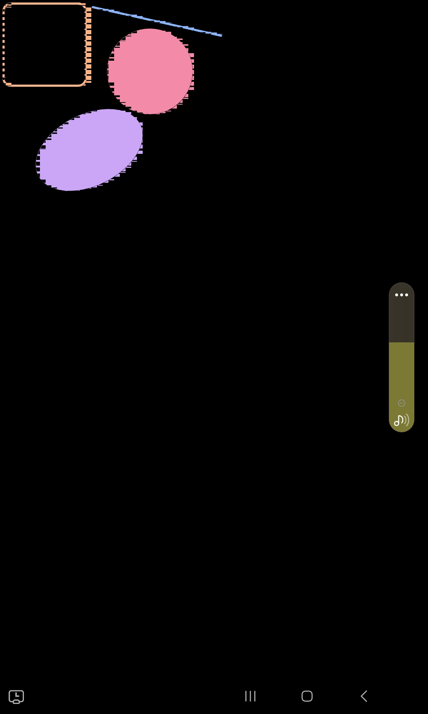

# minimal vello glitch example

This is an adaptation of the vello basic example for android. It works on one of my devices (my samsung galaxy A14 5G) but doesn't on my tablet (samsung galaxy tab s6 lite). The issue on the S6 lite is that there are graphical glitches, shown bellow.

## Running:
### Dependencies
- [cargo mobile 2](https://github.com/tauri-apps/cargo-mobile2)

To run it, connect your android device to the computer you are compiling it on, turn on usb or wireless debigging, attach (`adb attach`) or connect (`adb connect`) it respectively and run `cargo android run`. 
